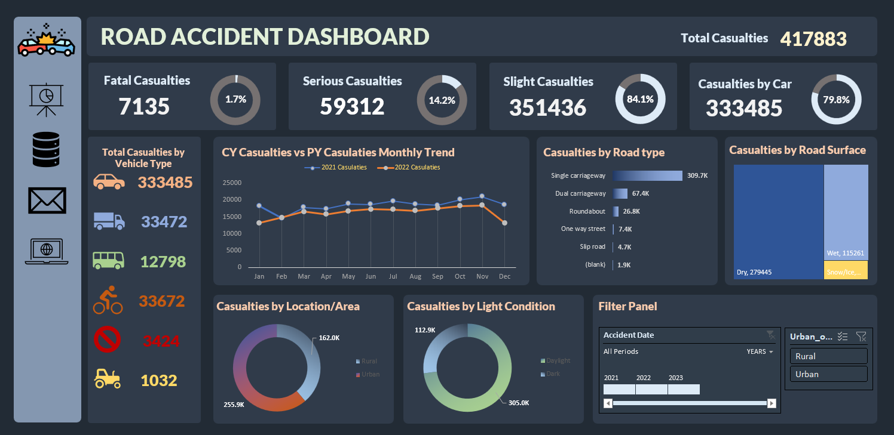

# Road Accident Dashboard 🚗
## Project Overview
This Excel dashboard provides a comprehensive analysis of road accidents, offering visual insights through charts and graphs. The project aims to highlight patterns and trends in road accidents to promote better understanding and inform preventative measures.

## Features 🌟
- **Interactive Charts**: Visualize data on road accidents by location, time, and severity.
- **Filter Options**: Users can filter data to view specific metrics, making it easier to find relevant information.
- **Trend Analysis**: Includes trend lines and comparative analysis to observe changes over time.

## Data Source
The data used in this dashboard has been sourced from [Name of the Source]. It includes records from [start year] to [end year], covering various parameters like accident locations, casualty figures, and time of occurrence.

## Tools Used

Utilized for creating the dashboard, data manipulation, and visualizations.

## How to Use
1. Download the Excel file from this repository.
2. Open the file using Microsoft Excel.
3. Use the provided filters and interactive elements to explore different aspects of the data.

## Screenshots
  
*Example of the Road Accident Dashboard*
